# 🌟 TravelLens AI 🌟
### *Smart Tour Guide & AI-Powered Landmark Explorer*

[](https://nodejs.org/)
[](https://expressjs.com/)
[](https://www.mongodb.com/)
[](https://fastapi.tiangolo.com/)
[](https://groq.com/)
[](https://aws.amazon.com/)
[](https://render.com/)
[](https://www.figma.com/design/Z9r6rlymeDfUySwQjXKfio/Travellens?node-id=0-1&t=LN3SRgy8gKldmSnQ-1)

---

## 📖 Table of Contents
1. [✨ Project Overview](#-project-overview)
2. [🚀 Key Features](#-key-features)
3. [⚙️ System Architecture](#️-system-architecture)
4. [🛠️ Technology Stack & Rationale](#️-technology-stack--rationale)
5. [🎨 Figma Design & Prototype](#-figma-design--prototype)
6. [🧪 Manual Testing Protocols](#-manual-testing-protocols)
7. [🌐 Deployment Architecture](#-deployment-architecture)
8. [📥 Clone & Local Setup](#-clone--local-setup)
9. [☁️ AWS AI Services Deployment](#️-aws-ai-services-deployment)

---

## ✨ Project Overview

**TravelLens AI** is a full-stack web application that turns your smartphone camera into an interactive personal tour guide. 

By uploading an image of a landmark, the app:
1. **Recognizes the landmark** instantly using OpenAI's **CLIP** computer vision model.
2. **Loads historical info** dynamically section-by-section via the **Wikipedia API**.
3. **Narrates the content** out loud using high-fidelity **Text-to-Speech (TTS)**.
4. **Hosts a personal chatbot tour guide** (Llama 3.1 via **Groq Cloud**) grounded in the landmark's real history, allowing users to ask follow-up questions in real-time.

---

## 🚀 Key Features

* **AI Landmark Recognition (CLIP)**: Matches uploaded images to known landmarks in a vector registry using cosine similarity. Includes a custom `0.70` confidence threshold to avoid false identifications.
* **On-Demand Wikipedia Loading**: Dynamically fetches specific sections only when you expand accordion items, saving network bandwidth. HTML is sanitized and formatted.
* **Master "Listen All" TTS Playlist**: Generates natural voice narration powered by Microsoft Neural voices. Clicking "Listen All" triggers a continuous, scroll-synced queue that scrolls and highlights each section text as it is read.
* **Context-Aware Chatbot with History**: An interactive "Master Tour Guide" powered by Groq's `llama-3.1-8b-instant`. The bot gathers page details and Wikipedia data dynamically to answer questions factually. Both user and bot histories are saved permanently in MongoDB.
* **Smart Cache Purging**: Utilizes a service worker unregistration setup (`sw.js` and `cache-cleaner.js`) to clear persistent browser caches, ensuring the user always sees the latest updates immediately upon deployment.

---

## ⚙️ System Architecture

```mermaid
sequenceDiagram
    autonumber
    actor User as 📱 Client Browser
    participant Web as 🖥️ Render Web Server (Express)
    participant DB as 🍃 MongoDB Atlas
    participant AI as ☁️ AWS EC2 AI Server (FastAPI)
    participant Groq as ⚡ Groq Cloud API
    participant Wiki as 🌐 Wikipedia REST API

    User->>Web: Uploads Landmark Image
    Web->>AI: POST /search (Image File)
    Note over AI: Runs CLIP & Cosine Similarity Match
    AI-->>Web: Returns Landmark Name, wikiLink & Match Score
    
    rect rgb(20, 20, 30)
        Note right of Web: Validation: Score must be >= 0.70
    end

    Web->>Wiki: Fetch Summary & Thumbnail
    Wiki-->>Web: Text Summary & Image URL
    Web->>DB: Save search record
    DB-->>Web: Saved Search ID
    Web-->>User: Redirect to /details/:id (Renders details EJS template)
    
    rect rgb(30, 20, 20)
        Note over User, Web: Interactive AI Chat Session
    end
    User->>Web: Sends message "Who built this?"
    Web->>Wiki: Fetch summary for RAG Context
    Wiki-->>Web: Context details
    Web->>AI: POST /chat (User Message + RAG Context)
    AI->>Groq: Query llama-3.1-8b-instant
    Groq-->>AI: Returns Factual Response
    AI-->>Web: Bot Message
    Web->>DB: Save dialog to chatHistory array
    Web-->>User: Render Bot response (TTS naration active!)
```



---

## 🛠️ Technology Stack & Rationale

* **Frontend (EJS, CSS3, Vanilla JS)**: Fast, server-rendered views with zero heavy frontend bundle overhead, ensuring fast loading speeds and SEO friendliness.
* **Backend Web Server (Node.js & Express)**: High-speed request router, ideal for managing sessions, proxying text-to-speech audio streams, and handling multipart image uploads.
* **Database Layer (MongoDB & Mongoose)**: NoSQL document store perfectly suited for storing user accounts, dynamic search logs, bookmarks, and list arrays like chat histories.
* **AI Microservice (FastAPI & CLIP)**: Asynchronous Python microservice hosting OpenAI's CLIP neural network for fast feature extraction and image matching.
* **Groq Cloud (Llama 3.1 8B)**: Provides sub-second LLM inference times via specialized LPUs, ensuring the chatbot responds instantly.
* **Edge Text-to-Speech (edge-tts)**: Synthesizes high-quality, human-sounding neural voices directly from Microsoft servers, saving local server computing power.

---

## 🎨 Figma Design & Prototype

We designed high-fidelity interactive wireframes and layout prototypes in Figma before building TravelLens AI to ensure a premium UI/UX:

* **🎨 Figma Design System**: [Inspect Layout & Design Files](https://www.figma.com/design/Z9r6rlymeDfUySwQjXKfio/Travellens?node-id=0-1&t=LN3SRgy8gKldmSnQ-1) *(Typography, color palettes, glassmorphism templates, and asset exports).*
* **⚡ Figma Interactive Prototype**: [Experience the Live UX Prototype](https://www.figma.com/proto/Z9r6rlymeDfUySwQjXKfio/Travellens?node-id=2-9&t=Fx6Z1sacfF4vT4Wy-1&scaling=scale-down&content-scaling=fixed&page-id=0%3A1&starting-point-node-id=2%3A8&show-proto-sidebar=1) *(Test transitions, dashboard navigation flows, and interactive mockups before deployment).*

---

## 🧪 Manual Testing Protocols

We tested every feature manually to ensure maximum software reliability:

1. **AI Image Match Check**: Uploading a clear photo of the *Taj Mahal* returns an exact match redirect. Uploading an abstract or unrelated image (e.g. a keyboard) drops below `0.70` matching confidence and triggers a clean 404 fallback page.
2. **Text-to-Speech Narration**: Clicked play buttons strip academic citations (e.g. `[1]`) correctly and produce natural audio speech.
3. **Master "Listen All" Queue**: Activating the master play button launches a sequential queue, automatically scrolling and highlighting active accordion elements.
4. **Chat RAG Integrity**: Questioning the bot with specific details only answers within the scope of the landmark's page context. Hallucinations are successfully blocked.
5. **Session Lock Guard**: Accessing internal pages like `/home` or `/account` without an active session correctly redirects users back to `/login`.

---

## 🌐 Deployment Architecture

* **Web Application (Render)**: Deployed as a high-performance Express app on Render, utilizing secure sessions backed by MongoDB Atlas.
* **AI Backend Service (AWS EC2)**: Hosted on a free-tier **Ubuntu EC2 instance (`t2.micro`)**. An **8GB virtual swapfile** is configured to allow high-memory neural networks (CLIP) to load and execute vector operations stably without crashing. Managed under **PM2** for auto-restarts and background persistence.

---

## 📥 Clone & Local Setup

### Prerequisites
* [Node.js](https://nodejs.org/) installed (v18+)
* [Python 3.8+](https://www.python.org/) installed
* A running [MongoDB](https://www.mongodb.com/try/download/community) instance

### Setup Steps
1. **Clone the Repository**:
   ```bash
   git clone https://github.com/vaishnavijawalkar16/Travellens.git
   cd Travellens
   ```
2. **Install Node dependencies**:
   ```bash
   npm install
   ```
3. **Configure Environment Variables**:
   Create a `.env` file in your project's root folder:
   ```env
   PORT=3000
   MONGODB_URI=your_mongodb_connection_string
   JWT_SECRET=your_secret_key
   SESSION_SECRET=your_session_secret_key
   AI_SERVICE_URL=http://your-aws-ec2-ip:8000/search
   GROQ_API_KEY=your_groq_api_key
   ```
   > [!NOTE]
   > **Important Security & AWS Setup Info**: This project does not contain any hardcoded or pre-configured AWS host URLs as those are linked to private developer resources. **You must set up your own personal/organizational AWS account, launch an EC2 instance, and use your own public IP address in the `AI_SERVICE_URL` variable.** Follow the AWS AI Services Deployment steps below to provision your own system.
4. **Run the App**:
   ```bash
   npm run dev
   ```
   Open [http://localhost:3000](http://localhost:3000) to view the application locally.

---

## ☁️ AWS AI Services Deployment

For the landmark AI recognition, TTS, and Chatbot capabilities to work properly, you must deploy the Python FastAPI services on an AWS EC2 instance:

### Step 1: Provision your EC2 Instance
1. Launch a **`t2.micro`** instance in the AWS Console running **Ubuntu Server 22.04 LTS**.
2. **Configure Security Groups**:
   * Add a Custom TCP inbound rule for **Port 8000** allowing traffic from **Anywhere (0.0.0.0/0)** so your Express app can communicate with the AI APIs.
   * Make sure **Port 22** (SSH) is open.

### Step 2: Configure System & Dependencies
SSH into your instance and run the pre-configured system script `setup_aws.sh` to update packages, establish swap space, install Python, Node, and PM2:
```bash
# Upload or clone files on EC2, then run:
chmod +x setup_aws.sh
./setup_aws.sh
```

> [!IMPORTANT]
> The `setup_aws.sh` script sets up an **8GB Swap space** on the server. Without this virtual memory, the lightweight `t2.micro` server will run out of RAM and crash while loading CLIP's neural layers.

### Step 3: Download Models & Embeddings
Activate the environment and pre-download the models:
```bash
source venv/bin/activate
python download_models.py
```

### Step 4: Configure EC2 Environment Keys
Create a `.env` file on your EC2 workspace to authorize Groq API operations:
```env
GROQ_API_KEY=your_groq_api_key
```

### Step 5: Start AI APIs with PM2
Launch the microservice in the background so it runs permanently:
```bash
pm2 start ai_service.py --name travellens-ai --interpreter /home/ubuntu/venv/bin/python
pm2 save
pm2 startup
```

### Step 6: Connect Express App
Ensure your Node server's `.env` configuration has the correct EC2 endpoint pointing to your own personal FastAPI service:
```env
AI_SERVICE_URL=http://your-aws-ec2-public-ip:8000/search
```

> [!WARNING]
> **Use Your Own AWS Server Endpoint Only**: Do not use or attempt to query external AWS endpoints. As these cloud instances are run on private, personal AWS accounts, they are strictly restricted and will fail to respond. You must complete steps 1–5 on your own personal AWS account, configure your own security groups, and populate `AI_SERVICE_URL` with your own machine's IP.

Restart your Node server. The console should display a heartbeat success log:
```text
Checking AI Service connectivity... (http://your-aws-ec2-public-ip:8000)
---------AWS AI Service is ONLINE and reachable!---------
```

Your TravelLens Web Application is now fully synchronized with your own AWS-hosted AI engine!

---

### 📄 License
Developed with ❤️ by Vaishnavi.